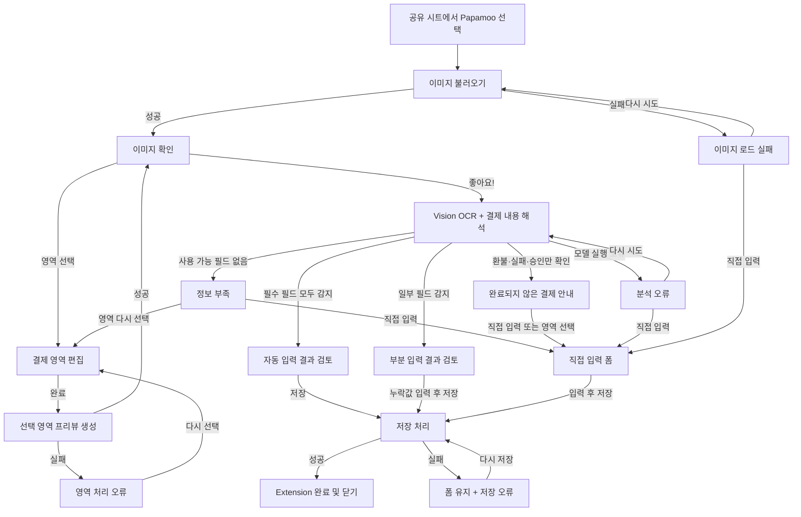

# Share Extension 결제 메일 구독 가져오기 명세

## 1. 문서 목적

iOS 공유 시트에서 결제 완료 이메일 캡처를 Papamoo로 전달하고, 이미지의 결제 정보를 추출해 구독을 등록하는 흐름을 정의한다.

이 문서의 기준 UI는 선택된 `컴팩트 시트형` 목업이다. 확인, 선택적 영역 지정, OCR, 결과 검토, 정보 부족·분석 오류 시 직접 입력, 저장 완료까지를 Share Extension 안에서 처리한다.

## 2. 제품 결정

- Share Extension을 선택한 시점에는 사용자의 가져오기 의도가 이미 형성되어 있다.
- 사용자가 `좋아요!`를 누르면 Vision OCR을 수행한 뒤 Foundation Models로 결제 정보를 구조화한다.
- Foundation Models는 결제 완료, 환불, 결제 실패, 카드 승인만 된 상태를 구분한다.
- Apple Intelligence를 사용할 수 없거나 현재 언어를 지원하지 않을 때만 기존 규칙 파서를 fallback으로 사용한다.
- 모델 호출, structured output 디코딩, 컨텍스트 크기 초과 등의 오류는 규칙 파서로 덮지 않고 분석 오류로 사용자에게 알린다.
- 모델이 정상적으로 환불·실패·승인만 된 문서로 분류한 경우 규칙 파서로 재시도하지 않는다.
- 규칙 fallback은 명시적인 결제 완료 문구가 있는 경우에만 값을 추출한다. 갱신 예정, 청구 예정, 단순 가격 안내는 결제로 간주하지 않는다.
- 구매 영수증은 `purchase`와 함께 `receipt`, `transaction id`, `charged to` 중 하나가 확인될 때 완료 근거로 인정한다.
- 영역 지정은 선택 기능이다. 기본 흐름에서는 전체 이미지를 바로 분석한다.
- OCR 결과는 곧바로 저장하지 않고 기존 구독 추가 폼에서 사용자가 검토한다.
- 일부 필드만 추출한 경우는 실패가 아니다. 찾은 값만 채우고 누락 필드를 사용자가 입력한다.
- 사용할 수 있는 필드를 하나도 찾지 못한 경우는 오류가 아니라 정보 부족으로 처리한다.
- 정보 부족 시 `영역 다시 선택`과 `직접 입력`을 모두 제공한다.
- Share Extension에서 Papamoo 본 앱을 자동 실행하지 않는다. 최종 저장까지 Extension 안에서 완료한 뒤 원래 앱으로 돌아간다.
- 공유된 원본 데이터와 OCR 원문은 현재 가져오기 세션에만 사용한다.
- 메인 앱에서 다시 확인할 수 있도록, 화면 표시에 맞게 다운샘플링한 전체 문서 이미지는 구독 데이터와 함께 선택적으로 저장한다.

## 3. 현재 저장 모델과의 관계

기존 `Subscription` 필드에 공유 가져오기 출처를 보관하는 선택 필드를 추가한다. 직접 입력하거나 기존에 저장된 구독은 해당 필드가 `nil`이어도 정상 동작해야 한다.

| 저장 필드 | 타입 | 입력 정책 |
| --- | --- | --- |
| `name` | `String` | 필수. OCR, 프리셋 매칭 또는 사용자 입력 |
| `amount` | `Decimal` | 필수. 0보다 커야 함 |
| `currencyCode` | `String` | OCR 결과 또는 현재 앱 기본 통화 |
| `billingCycle` | `BillingCycle` | OCR 결과 또는 기존 기본값 `.monthly` |
| `firstPaymentDate` | `Date` | OCR 결제일 또는 기존 기본값 `.now` |
| `category` | `SubscriptionCategory` | 프리셋 매칭 결과 또는 기존 기본값 `.other` |
| `note` | `String` | OCR 대상이 아님. 기본값 빈 문자열 |
| `iconName` | `String?` | 프리셋 서비스와 매칭된 경우에만 설정 |
| `sourceImageData` | `Data?` | 공유한 전체 문서의 다운샘플 JPEG. SwiftData external storage 사용 |
| `sourceCropX/Y/Width/Height` | `Double?` | OCR에 사용한 선택 영역의 정규화 좌표. 영역 미선택 시 `nil` |

저장 유효성은 현재 규칙인 `name`이 비어 있지 않고 `amount > 0`인 조건을 유지한다.

### 3.1 임시 가져오기 초안

OCR 결과는 저장 모델에 바로 넣지 않고 세션 전용 `SubscriptionImportDraft`에 보관한다.

초안이 보관해야 하는 정보:

- 원본 공유 데이터: Extension 실행 중에만 유지
- 저장용 전체 문서 이미지: 화면 표시에 필요한 해상도로 다운샘플링해 유지
- 선택 영역: 이미지 기준 정규화 좌표, 미선택 시 전체 영역
- OCR 원문: Extension 실행 중에만 유지
- 서비스명, 금액, 통화, 결제일, 결제 주기, 카테고리 후보
- 매칭된 `PresetService`
- 각 필드의 출처: `ocr`, `presetMatch`, `user`, `defaultValue`
- 각 필드의 검토 상태: `confirmed`, `needsReview`, `missing`

기존 모델의 기본값을 사용한 필드는 `자동 감지`로 표시하지 않는다. 기본값과 OCR 결과를 UI에서 구분한다.

## 4. 전체 상태 흐름

상단 `×` 또는 시스템의 아래로 쓸어내리기는 완료 전 모든 상태에서 취소로 처리한다. 진행 중인 OCR 작업을 중단하고 임시 초안을 폐기하며 저장 데이터는 만들지 않는다.

## 5. 상태별 UI와 동작

### S0. 이미지 불러오기

목적: `NSItemProvider`에서 공유 이미지를 읽고 화면이 비어 보이는 시간을 방지한다.

- 시트는 즉시 표시한다.
- Papamoo 아이콘, 이름, 상단 `×`, grabber를 먼저 표시한다.
- 이미지 영역에는 스켈레톤과 작은 인디케이터를 표시한다.
- 문구: `사진을 불러오고 있어요`
- OCR은 실행하지 않는다.

성공하면 S1, 실패하면 S6으로 이동한다.

### S1. 이미지 확인

목적: OCR 실행 전에 대상 이미지를 크게 확인한다.

- Share Extension 시트는 시스템이 허용하는 범위에서 최대 높이를 요청한다.
- 이미지가 시트 가용 높이의 절반 이상을 차지하도록 한다.
- 원본 비율을 보존하고 기본 상태에서는 자르지 않는다.
- 사진 우측 하단에 보조 동작 `영역 선택`을 표시한다.
- 선택 영역을 적용한 뒤 확인 화면의 이미지는 실제 잘린 프리뷰로 교체한다.
- 영역을 다시 편집하면 전체 문서 위에 기존 선택 범위를 복원한다.
- 노란 기본 버튼은 하단 안전 영역 가까이에 고정한다.
- 별도 하단 취소 버튼은 두지 않는다.

문구:

- 메타: `IMPORT SUBSCRIPTION`
- 제목: `결제 정보를 가져올까요?`
- 설명: `사진에서 서비스, 금액, 결제일을 찾아드릴게요.`
- 기본 동작: `좋아요!`
- 보조 동작: `영역 선택`

접근성:

- `좋아요!`의 접근성 이름은 `결제 정보 분석 시작`으로 제공한다.
- `영역 선택`은 `결제 정보가 있는 이미지 영역 선택`으로 설명한다.

### S2. 결제 영역 편집

목적: 결제 정보 주변에 다른 텍스트가 많을 때 OCR 범위를 사용자가 제한한다.

- 원본 이미지를 가능한 크게 표시한다.
- 선택 영역 외부는 어둡게 처리한다.
- 노란 테두리와 네 개의 조절 핸들을 제공한다.
- 선택 영역 내부 드래그로 이동하고, 네 꼭짓점 핸들 드래그로 가로·세로 크기를 조절한다. 핀치 확대·축소도 함께 지원한다.
- 선택 영역은 이미지 방향을 보정한 뒤 정규화 좌표로 저장한다.
- OCR에는 잘라낸 새 이미지를 만들기보다 Vision 요청의 관심 영역으로 전달한다.

문구와 동작:

- 제목: `결제 영역 선택`
- 안내: `필요한 결제 정보만 남겨주세요.`
- 보조 안내: `PINCH TO ZOOM`
- 좌측: 뒤로 가기. 변경을 폐기하고 S1로 이동
- 우측: `완료`. 선택 영역을 적용하고 S1로 이동

### S3. OCR 및 결제 내용 해석 진행

목적: 사용자가 처리가 진행 중임을 인지하게 한다.

- 선택 영역이 있으면 해당 영역, 없으면 전체 이미지에 Vision OCR을 수행한다.
- OCR 텍스트는 Foundation Models의 guided generation으로 결제 상태, 서비스, 최종 청구 금액, 통화, 결제일, 결제 주기를 구조화한다.
- 모델 결과는 OCR 원문 evidence와 대조한 뒤에만 초안에 반영한다.
- 날짜와 결제 주기는 모델 값이 evidence의 실제 날짜·주기와 일치할 때만 반영한다.
- `$` 또는 `¥` 기호만으로 추론한 통화는 검토가 필요한 값으로 표시한다.
- 모델이 명확한 결제 완료 문서로 분류한 경우에만 구독 초안을 만든다.
- 모델이 성공적으로 응답한 뒤 누락된 값은 규칙 파서로 보충하지 않는다.
- OCR 전문을 임의 길이로 잘라내지 않는다. 모델 컨텍스트 오류가 발생하면 분석 오류로 전달하고 영역 선택을 안내한다.
- 이미지 위에 노란 스캔 라인과 코너 표시를 사용한다.
- 실제 진행률을 계산하지 않으므로 퍼센트를 표시하지 않는다.
- 인디케이터는 비결정형으로 표시한다.
- 중복 탭을 막기 위해 기본 버튼을 제거한다.
- 상단 `×`는 유지하고 누르면 작업을 취소한다.

문구:

- 메타: `SCANNING IMAGE`
- 제목: `결제 정보를 찾고 있어요`
- 설명: `서비스, 금액, 결제일을 확인합니다.`

결과 분류:

- 서비스명과 금액을 모두 사용할 수 있음: S4 완전 결과
- 하나 이상의 필드를 사용할 수 있지만 서비스명 또는 금액이 없음: S4 부분 결과
- 사용할 수 있는 필드가 없음: S5 정보 부족
- 환불·결제 실패·승인만 됨: S5A 완료되지 않은 결제
- 모델 호출·응답 해석 오류: S5B 분석 오류

신뢰도 숫자는 사용자에게 노출하지 않는다. 모호한 값을 임의로 확정하지 않고 `needsReview`로 전달한다.

### S4. 결과 검토 및 구독 추가

목적: 자동 입력값을 사용자가 검토하고 수정한 뒤 저장한다.

기존 `AddSubscriptionDetailView`의 정보 구조를 유지한다.

- 서비스 아이콘, 이름, 카테고리
- Amount
- Currency
- Billing
- First payment
- Category
- Note
- `ADD SUBSCRIPTION`

완전 결과:

- 찾은 값을 각 필드에 입력한다.
- 자동 입력 영역에 `AUTO-FILLED`를 한 번만 표시한다.
- 모든 필드는 편집할 수 있다.

부분 결과:

- 상단 안내: `일부 정보만 찾았어요`
- 보조 안내: `비어 있는 항목을 확인해 주세요.`
- 찾은 값만 입력한다.
- 누락된 필수 필드는 빈 상태와 오류가 아닌 안내 상태로 표시한다.
- `name` 또는 `amount`가 유효하지 않으면 저장 버튼을 비활성화한다.

기본값 처리:

- OCR로 찾지 못한 통화, 결제 주기, 날짜, 카테고리는 현재 앱의 기본값을 사용할 수 있다.
- 기본값에는 `AUTO-FILLED`를 적용하지 않고 `기본값`임을 접근성 설명에 포함한다.
- 금액 후보가 여러 개이고 결제 금액을 확정할 수 없으면 금액을 비워 둔다.
- 결제 주기가 이미지에 명시되지 않았으면 `.monthly`를 기존 폼 기본값으로 보여주되 OCR 결과로 취급하지 않는다.
- 서비스가 `PresetService`와 매칭되면 프리셋의 아이콘과 카테고리를 사용한다.
- 프리셋과 매칭되지 않으면 OCR 서비스명을 유지하고 아이콘은 설정하지 않는다.

### S5. 정보 부족

목적: 추출할 정보가 부족함을 알리고 사용자가 작업을 버리지 않고 복구하게 한다.

문구:

- 제목: `결제 정보를 찾지 못했어요`
- 설명: `영역을 다시 선택하거나 직접 입력할 수 있어요.`

동작:

- `영역 다시 선택`: S2로 이동하고 기존 선택 영역이 있으면 유지한다.
- `직접 입력`: S7로 이동한다.
- 상단 `×`: Extension 요청을 취소한다.

버튼 우선순위:

- 아직 영역 지정을 시도하지 않은 경우: `영역 다시 선택`을 노란 기본 버튼으로 표시한다.
- 이미 영역 지정 후에도 실패한 경우: `직접 입력`을 노란 기본 버튼으로 표시한다.
- 나머지 동작은 텍스트 또는 외곽선 보조 버튼으로 표시한다.

### S5A. 완료되지 않은 결제

Foundation Models가 환불, 결제 실패, 카드 승인만 된 상태로 정상 분류한 결과다. 오류나 정보 부족으로 합치지 않는다.

- 상태별 제목과 설명으로 완료 결제가 아닌 이유를 알린다.
- 규칙 파서로 재해석하지 않는다.
- 기본 동작은 `직접 입력`, 보조 동작은 `영역 다시 선택`이다.

### S5B. 분석 오류

모델 호출, structured output 디코딩, 컨텍스트 한도 등 분석 과정에서 발생한 오류다.

- 제목: `결제 정보를 분석하지 못했어요`
- 설명: `분석 중 오류가 발생했습니다. 다시 시도하거나 직접 입력해 주세요.`
- 기본 동작: `다시 시도`
- 보조 동작: `직접 입력`
- 규칙 파서나 빈 결과로 오류를 숨기지 않는다.
- OCR 원문은 기록하지 않고 오류 설명만 Xcode 콘솔에 기록한다.

### S6. 이미지 로드 실패

정보 부족 및 분석 오류와 구분한다. 이 상태에서는 OCR을 실행하지 못했다.

- 제목: `사진을 불러오지 못했어요`
- 설명: `다시 시도하거나 구독 정보를 직접 입력해 주세요.`
- 기본 동작: `다시 시도`
- 보조 동작: `직접 입력`
- 반복 실패 시에도 오류를 숨기거나 빈 화면으로 전환하지 않는다.

### S7. 직접 입력

목적: OCR을 사용할 수 없더라도 구독 등록을 완료한다.

- 기존 구독 추가 폼을 그대로 사용한다.
- OCR 값은 채우지 않는다.
- 서비스명과 금액은 빈 상태로 시작한다.
- 통화, 결제 주기, 날짜, 카테고리는 기존 폼의 기본값을 사용하며 자동 감지로 표시하지 않는다.
- 사용자가 원본을 참고할 수 있도록 상단에 접힌 `원본 보기`를 제공한다. 이미지 로드 자체가 실패했다면 표시하지 않는다.
- 유효성 조건은 기존과 동일하게 서비스명과 0보다 큰 금액이다.
- 저장 전 사용자가 입력한 값의 출처는 `user`로 갱신한다.

### S8. 저장 처리와 완료

- 저장 버튼을 누르면 중복 입력을 막고 버튼 안에 작은 인디케이터를 표시한다.
- 저장 버튼 상태는 디스크 작업을 시작하기 전에 즉시 `저장 중`으로 바꾸고 저장은 비동기로 수행한다.
- App Group의 SwiftData 저장소에 `Subscription`을 한 번만 삽입한다.
- 공유 가져오기에서 생성한 구독에는 다운샘플된 전체 문서와 선택 영역 좌표를 함께 저장한다.
- 저장이 성공한 뒤에만 Extension 요청을 완료한다.
- 완료 직전 짧게 `저장했어요` 피드백을 표시하고 원래 앱으로 돌아간다.
- Extension이 완료된 뒤 원본 공유 데이터, OCR 원문, 임시 초안을 폐기한다. 구독에 저장한 다운샘플 문서는 유지한다.

저장 실패:

- 폼을 닫지 않는다.
- 사용자가 입력하거나 수정한 값을 유지한다.
- 제목: `구독을 저장하지 못했어요`
- 설명: `잠시 후 다시 시도해 주세요.`
- 동작: `다시 저장`
- 현재 `AddSubscriptionViewModel.save()`의 단순 `Bool` 결과는 구현 시 사용자에게 표시할 수 있는 오류 상태로 연결해야 한다.

## 6. OCR 및 필드 매핑 정책

OCR은 기기 내 Vision 텍스트 인식을 사용한다. 네트워크 업로드는 하지 않는다.

### 6.1 서비스명

1. 결제처, 상품명, 상호명 주변 텍스트를 후보로 수집한다.
2. 후보를 `PresetService.all`의 이름과 정규화해 비교한다.
3. 명확히 매칭되면 프리셋 이름, 아이콘, 카테고리를 사용한다.
4. 매칭되지 않으면 가장 유력한 원문을 서비스명 후보로 제공하고 `needsReview`로 표시한다.

### 6.2 금액과 통화

1. 통화 기호나 코드와 함께 나타나는 숫자를 후보로 수집한다.
2. `결제 금액`, `총액`, `승인 금액`처럼 의미가 명확한 라벨을 우선한다.
3. 여러 후보 중 하나를 확정할 근거가 없으면 추측하지 않고 금액을 비워 둔다.
4. `₩`, `원`, `KRW`는 KRW로 정규화한다.

### 6.3 결제일

- `결제일`, `승인일`, `거래일시`에 해당하는 날짜를 우선한다.
- 시간은 저장하지 않고 앱 모델에 맞게 날짜만 사용한다.
- 다음 결제 예정일과 실제 결제일이 함께 있으면 실제 결제일을 `firstPaymentDate` 후보로 사용한다.
- 어떤 날짜인지 구분할 수 없으면 기본 날짜를 유지하고 `needsReview`로 표시한다.

### 6.4 결제 주기와 카테고리

- `월간`, `매월`, `/MO`는 `.monthly` 후보로 처리한다.
- `연간`, `매년`, `/YR`는 `.yearly` 후보로 처리한다.
- 명시적인 주기 텍스트가 없으면 기존 `.monthly` 기본값을 유지하되 OCR 결과로 표시하지 않는다.
- 카테고리는 프리셋 매칭 결과에서만 자동 설정한다. 매칭되지 않으면 기존 `.other` 기본값을 사용한다.

## 7. 구현 경계

### Extension 내부 책임

- 공유 이미지 로드와 방향 보정
- 화면 표시용 이미지 다운샘플링
- 선택 영역 관리
- OCR 실행과 취소
- 텍스트 파싱과 프리셋 매칭
- 임시 초안 관리
- 결과 및 직접 입력 폼 표시
- App Group 저장소에 최종 구독 저장
- Extension 완료 또는 취소

### 재사용이 필요한 앱 코드

- `Subscription`, `BillingCycle`, `SubscriptionCategory`, `PresetService`
- 통화 포맷과 기본 통화 조회
- 구독 폼의 필드 구성과 유효성 규칙
- App Group `ModelConfiguration`
- 최종 저장을 담당하는 Extension-safe 저장 계층

앱과 Extension이 같은 입력 폼을 각자 복사해 유지하지 않도록 공통 View 또는 공통 폼 섹션으로 분리한다. 저장 계층 역시 `AddSubscriptionViewModel`에 직접 묶기보다 앱과 Extension에서 함께 사용할 수 있는 단일 책임으로 분리한다.

### v1 범위 밖

- 여러 장의 이미지를 한 번에 분석
- 공유된 원본 해상도의 이미지 영구 보관
- 서버 OCR 또는 이미지 업로드
- OCR 결과의 자동 저장
- Share Extension에서 Papamoo 본 앱 자동 실행
- 복수 구독을 한 이미지에서 동시에 생성

## 8. 접근성 및 사용성

- 모든 터치 대상은 최소 44pt를 확보한다.
- 크롭 핸들은 시각 크기보다 넓은 터치 영역을 사용한다.
- Dynamic Type에서 제목이나 버튼이 잘리지 않게 한다.
- OCR 시작, 부분 성공, 실패, 저장 완료를 VoiceOver 알림으로 전달한다.
- 스캔 애니메이션은 `Reduce Motion` 활성화 시 정적인 인디케이터로 대체한다.
- 색상만으로 자동 입력, 기본값, 누락 상태를 구분하지 않는다.
- 시트 높이가 시스템에 의해 줄어들면 이미지 영역을 우선 축소하고 하단 기본 버튼은 항상 접근 가능하게 유지한다.

## 9. 승인 조건

### 정상 흐름

- 한 장의 이미지 공유 시 확인 화면이 표시되고 OCR이 자동 시작되지 않는다.
- `좋아요!`를 눌러야 OCR이 시작된다.
- OCR 성공 시 기존 구독 폼에 값이 채워지고 저장 전 수정할 수 있다.
- 유효한 서비스명과 금액이 없으면 저장할 수 없다.
- 저장 성공 시 Extension이 완료되고 구독이 메인 앱과 위젯에서 조회된다.
- 공유로 저장한 구독의 수정 화면에서 `원본 문서 보기`를 펼쳐 전체 문서를 확인할 수 있다.

### 영역 선택

- `영역 선택` 진입과 복귀가 가능하다.
- 선택 영역은 이미지 회전과 화면 크기에 관계없이 동일한 원본 영역을 가리킨다.
- 영역 적용 후 확인 화면과 스캔 화면에는 선택 영역만 잘린 프리뷰가 표시된다.
- 선택 영역 밖 텍스트는 OCR 대상에서 제외된다.
- 영역 편집을 취소하면 이전 선택 상태가 손상되지 않는다.

### 부분 성공과 실패

- 일부 필드만 찾은 경우 실패 화면이 아니라 결과 폼으로 이동한다.
- 누락된 필수 필드는 사용자가 입력할 수 있다.
- 사용할 수 있는 필드가 없으면 정보 부족 화면을 표시한다.
- 정보 부족 화면에서 영역 재선택과 직접 입력 모두 가능하다.
- 영역 지정 후 다시 실패하면 직접 입력이 기본 동작으로 승격된다.
- 환불·결제 실패·승인만 된 문서는 완료 결제와 구분해 표시하고 규칙 파서로 재시도하지 않는다.
- 모델 실행 오류는 규칙 파서로 대체하지 않고 분석 오류로 표시한다.
- 이미지 로드 실패, 정보 부족, 분석 오류가 서로 다른 상태로 표시된다.

### 취소와 저장 오류

- 상단 `×` 또는 스와이프 취소 시 구독 데이터가 저장되지 않는다.
- OCR 진행 중 취소하면 작업과 임시 데이터가 정리된다.
- 저장 실패 시 폼이 닫히지 않고 사용자 입력이 유지된다.
- 저장 재시도로 동일 구독이 중복 생성되지 않는다.

### 개인정보와 성능

- OCR은 기기 내에서 실행된다.
- 원본 공유 데이터와 OCR 원문은 Extension 종료 후 남지 않는다.
- 저장용 전체 문서는 다운샘플된 JPEG로만 보관하고 SwiftData external storage를 사용한다.
- 큰 이미지도 화면 표시와 OCR에 필요한 크기로 다운샘플링해 Extension 메모리 제한을 넘지 않는다.

## 10. 구현 순서 제안

1. Share Extension 타깃과 단일 이미지 입력 규칙 추가
2. App Group 기반 공통 모델·저장 계층 연결
3. 세션 전용 `SubscriptionImportDraft`와 상태 머신 추가
4. 이미지 확인 및 선택 영역 편집 구현
5. Vision OCR과 필드 파서 구현
6. 기존 구독 폼 공통화 및 자동 입력·직접 입력 모드 연결
7. 정보 부족·완료되지 않은 결제·분석 오류·이미지 로드 실패·저장 실패 복구 흐름 구현
8. Extension 생명주기, 메모리, 접근성, 저장 중복 방지 테스트

## 참고

- [Apple App Extension Programming Guide - Share](https://developer.apple.com/library/archive/documentation/General/Conceptual/ExtensibilityPG/Share.html)
- [Vision `regionOfInterest`](https://developer.apple.com/documentation/vision/vnimagebasedrequest/regionofinterest)
- [Configuring App Groups](https://developer.apple.com/documentation/xcode/configuring-app-groups)
